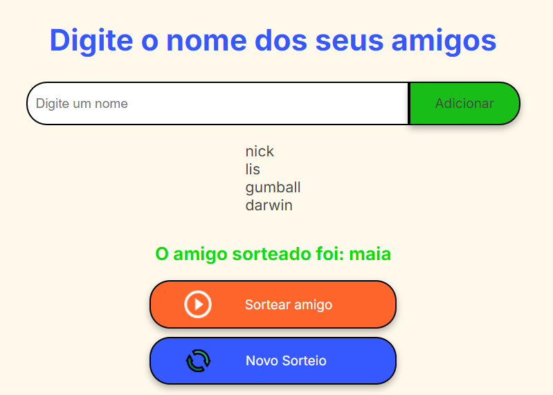

  
<h1 align="center">
    🔹 Jogo do Amigo Secreto 🔸
</h1>
 

O jogo do Amigo Secreto permite que o usuário insira os nomes de seus amigos, sendo que, ao clicar no botão "Sortear Amigo", um nome será selecionado aleatoriamente.  
Este projeto foi desenvolvido para o challenge da Alura, o código-fonte foi disponibilizado pela plataforma e após isso, foram feitas modificações em HTML e CSS. Já a parte em JavaScript foi desenvolvida completamente do zero.
- 
 Você pode adicionar quantos nomes forem necessários

- 
 É possível sortear nomes alatórios mais de uma vez na mesma lista

- 
 Reinicie o jogo e faça uma nova lista

- 
 Não é possível adicionar nomes estritamente iguais

  
  
  

## 🔨 Funcionalidades do projeto 

O jogo funciona da seguinte maneira: o usuário adiciona os nomes dos amigos que desejam participar.   Quando a lista estiver completa o usuário clica no elemento `<button>` através do '' sortear amigo '' para obter o nome de uma pessoa da lista aleatoriamente.

## ✔️ Técnicas e tecnologias utilizadas

- `HTML` O HTML já estava pronto nos arquivos iniciais, com pequenas mudanças feitas no código ao longo do projeto.
- `CSS`: O CSS já estava pronto nos arquivos iniciais, porém foram feitas algumas modificações e adições de elementos nesta parte do código.
- `JavaScript`: O JavaScript foi feito do zero na intenção de desenvolver e aperfeiçoar os conhecimentos da linguagem, através do `<function>` foi possível obter um código mais limpo e sem repetições desnecessárias.

## Alguns tópicos abordados no projeto:
  - `querySelector`;
  - `getElementById`;
  - `arrays`;
  - `document`;
  - `const`;
  - `let`;
  - `function`;
  - `for`;
  - `if`;
  - `else`;
  - `li`;
  

## 📁 Acesso ao código do projeto

[Veja o código do Amigo Secreto aqui](index.html).

## 🛠️ Abrir e rodar o projeto

Para abrir e rodar o projeto, basta abrir o aquivo `index.html` no navegador.

> :construction: Projeto em construção com possíveis melhorias de acordo com a aprendizagem do autor :construction: 
